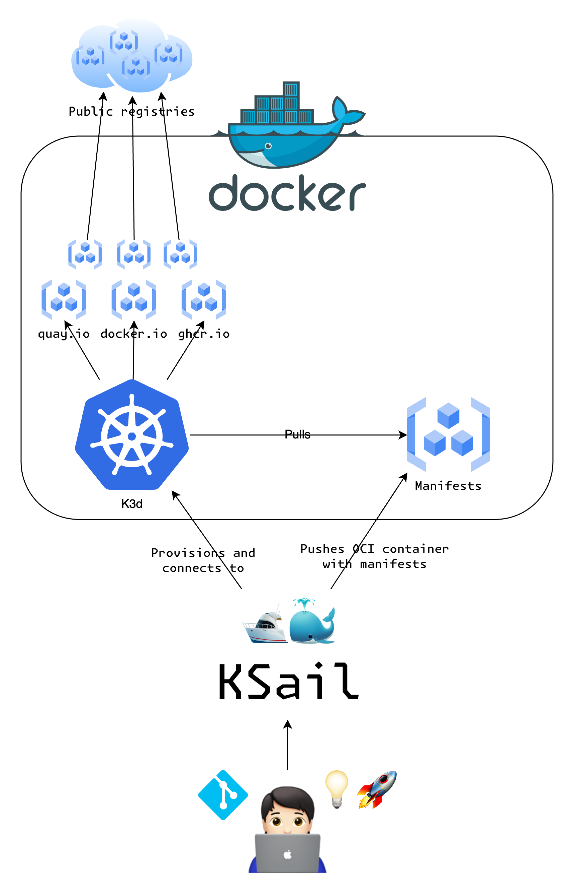

# 🛥️🐳 KSail

[](https://opensource.org/licenses/MIT)
[](https://github.com/devantler/ksail/actions/workflows/test.yaml)
[](https://codecov.io/gh/devantler/ksail)


<details>
  <summary>Show/hide folder structure</summary>

<!-- readme-tree start -->
```
.
├── .github
│   └── workflows
├── .vscode
├── images
├── scripts
├── src
│   └── KSail
│       ├── Arguments
│       ├── CLIWrappers
│       ├── Commands
│       │   ├── Check
│       │   │   └── Handlers
│       │   ├── Debug
│       │   │   └── Handlers
│       │   ├── Down
│       │   │   ├── Handlers
│       │   │   └── Options
│       │   ├── Init
│       │   │   ├── Generators
│       │   │   └── Handlers
│       │   ├── Lint
│       │   │   └── Handlers
│       │   ├── List
│       │   │   └── Handlers
│       │   ├── Root
│       │   │   └── Handlers
│       │   ├── SOPS
│       │   │   ├── Handlers
│       │   │   └── Options
│       │   ├── Start
│       │   │   └── Handlers
│       │   ├── Stop
│       │   │   └── Handlers
│       │   ├── Up
│       │   │   ├── Handlers
│       │   │   └── Options
│       │   └── Update
│       │       ├── Handlers
│       │       └── Options
│       ├── Enums
│       ├── Extensions
│       ├── Models
│       │   ├── K3d
│       │   ├── KSail
│       │   ├── Kubernetes
│       │   │   └── FluxKustomization
│       │   └── SOPS
│       ├── Options
│       ├── Provisioners
│       │   ├── ContainerEngine
│       │   ├── ContainerOrchestrator
│       │   ├── GitOps
│       │   ├── KubernetesDistribution
│       │   └── SecretManager
│       ├── TemplateEngine
│       └── assets
│           ├── binaries
│           └── templates
│               ├── k3d
│               ├── kubernetes
│               └── sops
└── tests
    └── KSail.Tests.Integration
        ├── Commands
        │   ├── Check
        │   ├── Debug
        │   ├── Down
        │   ├── Lint
        │   ├── List
        │   ├── Root
        │   ├── SOPS
        │   ├── Up
        │   └── Update
        └── TestUtils

74 directories
```
<!-- readme-tree end -->

</details>

## Getting Started

### Prerequisites

> [!NOTE]
> On MacOS (darwin) you need to "Allow the default Docker socket to be used (requires password)" in Docker Desktop settings.
>
> <details><summary>Show me how!</summary>
>
> 
>
> </details>

- Supported OSes
  - darwin-amd64 
  - darwin-arm64 
  - linux-amd64 🐧
  - linux-arm64 🐧
- [Docker](https://www.docker.com)
- Knowledge of [FluxCD](https://fluxcd.io)
- Knowledge of [Kustomize](https://kubectl.docs.kubernetes.io/guides/introduction/kustomize/)

### Installation

With Homebrew:

```sh
brew tap devantler/formulas
brew install ksail
```

Manually:

1. Download the latest release from the [releases page](https://github.com/devantler/ksail/releases).
2. Make the binary executable: `chmod +x ksail`.
3. Move the binary to a directory in your `$PATH`: `mv ksail /usr/local/bin/ksail`.

### Usage

KSail is built to run as either a local binary, or as a Docker container.

Setting sail for your voyage and navigating beyond the shore with KSail is as straightforward as:

```sh
ksail init <name-of-cluster>
```

- Generates a small cluster configuration with my recommended structure, Traefik, Cert-Manager, and Podinfo. This is a great starting point to build up your Kubernetes environments.
  - KSail will target the `k8s/clusters/<cluster-name>/flux-system` flux kustomizations. So you can follow their paths to get an idea on how the files are related.
    - `k8s/clusters/*` - This folder contains cluster configurations. This is the entrypoint for flux. I recommend having one cluster configuration per env (local, dev, test, prod).
    - `k8s/manifests/*` - This folder contains all the manifests to deploy. It is organized according to its kustomization, and it is assumed that all clusters can deploy these files (use flux-post-build variables for variables).
  - Flux kustomizations target files and folders within the flux-system OCI container that KSail creates. This container contains all files within `k8s/**`, so be aware that the paths are not from your projects root directory.
- Includes a `*.k3d-config.yaml` file to configure your K3d cluster. You can check out [the official k3d docs](https://k3d.io/v5.1.0/usage/configfile/) on how to use this configuration file.
- Includes a `.sops.yaml` file to configure SOPS. You can check out [the official SOPS docs](https://getsops.io/docs/#using-sopsyaml-conf-to-select-kms-pgp-and-age-for-new-files) on how to use this configuration file to configure which files should be encrypted/decrypted by which keys.

```sh
ksail up <name-of-cluster>
```

- Provisions a GitOps-enabled cluster from your working directory.

```sh
ksail update <name-of-cluster>
```

- Updates a cluster with new changes from your working directory.

```sh
ksail down <name-of-cluster>
```

- Debugs a cluster with the amazing [K9s](https://github.com/derailed/k9s) tool.

For more intricate navigational techniques, consult the global --help flag:

```sh
ksail --help
```

## What is KSail?



KSail is a CLI tool designed to simplify the management of GitOps-enabled Kubernetes clusters. It enables you to easily create, manage, and dismantle GitOps-enabled clusters in Docker, such that you can develop and test your applications in a fully local Kubernetes environment, before deploying them to other environments.

### Key Features

- **Initialize YAML and configuration:** KSail can be used to generate needed YAML and configuration files for your clusters.
- **Create clusters:** KSail can be used to create GitOps-enabled Kubernetes clusters in Docker.
- **Update clusters:** KSail can be used to update running Kubernetes clusters in Docker.
- **Lint manifests:** KSail can be used to lint your manifest files before deploying your clusters.
- **Debug clusters:** KSail can be used to debug your clusters with the K9s tool.
- **Check cluster reconciliations:** KSail can be used to verify that your clusters reconcile successfully after deployment.
- **Manage secrets:** KSail can be used to manage secrets in Git repositories with SOPS and Age.

## How does it work?

KSail leverages several key technologies to provide its functionality:

- **Embedded Binaries:** KSail embeds binaries, and provides APIs for awesome Kubernetes CLI tools. This enables KSail to work out of the box without requiring you to install any additional dependencies.
- **Container Engine Backends:** KSail uses various Container Engine backends, allowing you to run encapsulated Kubernetes clusters inside containers with a small footprint.
- **Flux GitOps:** KSail sets up Flux GitOps to manage the deployment of your clusters, with your manifest source serving as the single source of truth.
- **OCI:** KSail uses OCI registries to pull and push images to and from your clusters. This is what enables you to build and test your applications without needing to push them to a remote registry.
- **K9s Integration:** KSail integrates with K9s to provide a powerful CLI tool for debugging your clusters.
- **SOPS and Age Integration:** KSail integrates with SOPS and Age for managing secrets in Git repositories.
- **Kustomize and Kubeconform Integration:** KSail integrates with Kustomize and Kubeconform for linting your manifest files before deploying your clusters.
- **Kubernetes API:** KSail uses the Kubernetes API to verify that your clusters reconcile successfully after deployment.

## Why was it made?

KSail was created to fill a gap in the tooling landscape for managing GitOps-enabled Kubernetes clusters in Docker. There are currently two intended use cases for KSail:

- **Local Development:** KSail can be used to create and manage GitOps-enabled Kubernetes clusters in Docker for local development. This allows you to easily build and test your applications in a K8s environment.
- **CI/CD:** KSail can be used to spin up GitOps-enabled Kubernetes clusters in CI/CD, to easily verify that your changes are working as expected before deploying them to your other environments.

## Q&A

### Why use KSail instead of e.g. k3d or kind?

KSail is built on top of k3d, so it provides all the same functionality as k3d. However, KSail also provides additional functionality for managing GitOps-enabled Kubernetes clusters in Docker. For a GitOps-enabled cluster to work well in Docker, you need quite a few tools to be installed and configured. KSail aims to simplify this process by providing a set of commands that allow you to easily create, manage, and dismantle GitOps-enabled clusters.

### How can I run KSail as a Docker Container?

To run KSail as a Docker container you need to mount the Docker socket, your working directories, and KSail config files. You also need to run KSail on your host network to allow it to connect to containers on localhost.

```sh
docker run --rm \
  -v $(pwd):/app `# Mount working directories` \
  ghcr.io/devantler/ksail:latest init <name-of-cluster>

docker run --rm \
  -v /var/run/docker.sock:/var/run/docker.sock `# Mount Docker socket` \
  -v $(pwd):/app `# Mount working directories` \
  -v $(pwd):/root/.ksail `# Mount KSail config files` \
  --network host `# Allow access to containers on localhost` \
  ghcr.io/devantler/ksail:latest up <name-of-cluster>
```

### How do I use KSail with CI/CD?

You need to download the KSail binary into your CI/CD environment, and then run the KSail commands as you would locally. For example, if you are using GitHub Actions, you can use the following workflow:

```yaml
name: KSail

on:
  pull_request:
    branches: [main]
  push:
    branches: [main]

concurrency:
  group: ${{ github.workflow }}-${{ github.ref }}
  cancel-in-progress: true

jobs:
  ksail:
    runs-on: ubuntu-latest
    steps:
      - name: 📑 Checkout
        uses: actions/checkout@v4
      - name: 🍺 Set up Homebrew
        uses: Homebrew/actions/setup-homebrew@master
      - name: 🛥️🐳 Install KSail
        run: brew install devantler/formulas/ksail
      - name: 🛥️🐳🚀 KSail Up
        run: |
          ksail sops <name-of-cluster> --import "${{ secrets.KSAIL_SOPS_AGE_KEY }}"
          ksail up <name-of-cluster>
```

### What is next for KSail?

Features in the pipeline:

- **KSail Gen:** With the template engine implemented I intend to add support for various generators that can generate anything from Kubernetes manifests to config files.
- **Kind Support:** KSail will be able to create and manage GitOps-enabled Kubernetes clusters in Kind.
- **Talos in Docker Support:** KSail will be able to create and manage GitOps-enabled Kubernetes clusters in Docker with Talos Linux.
- **Setting Hosts:** KSail will be able to set hosts for services made accessible through ingresses.
- **KSail YAML config:** As KSail matures, I will support more container engines and Kubernetes distributions, so a way to set defaults will be required. As such I plan to add support for a YAML config file to specify KSail-related settings and defaults. KSail will support generating the file if it does not exist, or generate it with `ksail gen` when the template engine matures.

Features I'm considering:

- **ArgoCD Support through Flamingo:** Working with YAML is not necessarily the preferred approach for all, so I am contemplating including Flamingo as a helm release provided by the `ksail init` command, so users can choose to create new releases from ArgoCDs proven UI. This might just be a matter of installing Flamingo, and configuring it to work with the structure KSail provides.
- **VCluster Support:** I am considering adding support for VCluster, so users can create and manage VClusters in existing clusters.

## Related Projects

- [OCI Artifacts](https://github.com/devantler/oci-artifacts) - Ready-to-deploy OCI artifacts for Flux GitOps-enabled clusters.
- [Homelab](https://github.com/devantler/homelab) - My personal homelab setup, including an example of how I use KSail to manage my Homelab cluster.

## Contributions

Contributions to KSail are welcome! You can contribute by reporting bugs, requesting features, or submitting pull requests. When creating an issue or pull request, please provide as much detail as possible to help understand the problem or feature. Check out the [Contribution Guidelines](https://github.com/devantler/ksail/blob/main/CONTRIBUTING.md) for more info.
