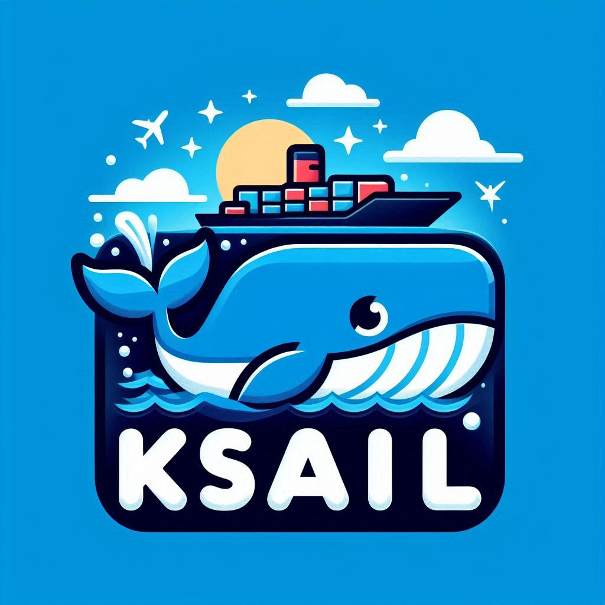

<div align="center">
  
</div>

# KSail

[](https://opensource.org/licenses/Apache-2.0)
[](https://github.com/devantler/ksail/actions/workflows/test.yaml)
[](https://codecov.io/gh/devantler/ksail)


<details>
  <summary>Show/hide folder structure</summary>

<!-- readme-tree start -->

```
.
├── .github
│   └── workflows
├── .vscode
├── KSail.Models
│   ├── Commands
│   │   ├── Check
│   │   ├── Debug
│   │   ├── Down
│   │   ├── Gen
│   │   ├── Init
│   │   ├── Lint
│   │   ├── List
│   │   ├── SOPS
│   │   ├── Start
│   │   ├── Stop
│   │   ├── Up
│   │   └── Update
│   └── Registry
├── docs
│   └── images
├── scripts
├── src
│   └── KSail
│       ├── Arguments
│       ├── CLIWrappers
│       ├── Commands
│       │   ├── Check
│       │   │   └── Handlers
│       │   ├── Debug
│       │   │   └── Handlers
│       │   ├── Down
│       │   │   ├── Handlers
│       │   │   └── Options
│       │   ├── Init
│       │   │   ├── Generators
│       │   │   └── Handlers
│       │   ├── Lint
│       │   │   └── Handlers
│       │   ├── List
│       │   │   └── Handlers
│       │   ├── Root
│       │   │   └── Handlers
│       │   ├── SOPS
│       │   │   ├── Handlers
│       │   │   └── Options
│       │   ├── Start
│       │   │   └── Handlers
│       │   ├── Stop
│       │   │   └── Handlers
│       │   ├── Up
│       │   │   ├── Handlers
│       │   │   └── Options
│       │   └── Update
│       │       ├── Handlers
│       │       └── Options
│       ├── Enums
│       ├── Extensions
│       ├── Models
│       │   ├── K3d
│       │   ├── KSail
│       │   ├── Kubernetes
│       │   │   └��─ FluxKustomization
│       │   └── SOPS
│       ├── Options
│       ├── Provisioners
│       │   ├── ContainerEngine
│       │   ├── ContainerOrchestrator
│       │   ├── GitOps
│       │   ├── KubernetesDistribution
│       │   └── SecretManager
│       └── assets
│           ├── binaries
│           └── templates
│               ├── k3d
│               ├── kubernetes
│               └── sops
└── tests
    └── KSail.Tests
        ├── Commands
        │   ├── Check
        │   ├── Debug
        │   ├── Down
        │   ├── Lint
        │   ├── List
        │   ├── Root
        │   ├── SOPS
        │   ├── Up
        │   └── Update
        └── TestUtils

89 directories
```

<!-- readme-tree end -->

</details>

## Getting Started

### Prerequisites

> [!NOTE]
> On MacOS, you need to "Allow the default Docker socket to be used (requires password)" in Docker Desktop settings.
>
> <details><summary>Show me how</summary>
>
> 
>
> </details>

KSail supports all major operating systems:

- MacOS (x64 and arm64)
- Linux (x64 and arm64)
- Windows (x64 and partially arm64)
  - Or WSL2

### Installation

With Homebrew:

```sh
brew tap devantler/formulas
brew install ksail
```

Manually:

1. Download the latest release for your OS from the [releases page](https://github.com/devantler/ksail/releases).
2. Make the binary executable: `chmod +x ksail`.
3. Move the binary to a directory in your `$PATH`: `mv ksail /usr/local/bin/ksail`.

### Usage

Getting started with KSail is easy. Here are a few commands to get you going:

`ksail init` - To initialize a new cluster with the default configuration.

`ksail up` - To provision your new cluster.

From there, you can make some changes to your manifest files, and when you are ready to apply them, you can run:

`ksail update` - To update your cluster.

At some point, you might encounter an issue and wonder what is going on. In that case, you can run:

`ksail check` - To check the status of your cluster reconciliations.

And for more advanced debugging, you can run:

`ksail debug` - To debug your cluster with the K9s tool.

Finally, when you are done working with your cluster, you can run:

`ksail stop <name-of-cluster>` - To stop your cluster, so you can continue working on it later.

Or if you really want to get rid of it for now, you can run:

`ksail down <name-of-cluster>` - To dismantle your cluster and remove its resources.

## Documentation

- [Overview](./docs/0-overview.md)
- [Configuration](./docs/1-configuration.md)
- [Structure](./docs/2-structure.md)
- [CI](./docs/3-ci.md)
- [KSail CLI](./docs/4-ksail-cli.md)
- [Supported Tooling](./docs/5-supported-tooling.md)
- [FAQ](./docs/6-faq.md)
- [Roadmap](./docs/7-roadmap.md)

## Sub-projects

KSail is part of a larger ecosystem of projects that I maintain. These projects are designed to provide important functionality to KSail with high confidence, and without bloating the main repository. Most the projects provide extensible frameworks, so you can build your own tools on top of them, or make contributions to make KSail even more powerful.

- **[devantler/dotnet-age-cli](https://github.com/devantler/dotnet-age-cli)** - A library that embeds and provides an API for the Age CLI.
- **[devantler/dotnet-cli-runner](https://github.com/devantler/dotnet-cli-runner)** - An implementation atop CLI Wrap to support running different binaries from C# code.
- **[devantler/dotnet-container-engine-provisioner](https://github.com/devantler/dotnet-container-engine-provisioner)** - Provisioners to provision resources in container engines like Docker or Podman.
- **[devantler/dotnet-flux-cli](https://github.com/devantler/dotnet-flux-cli)** - A library that embeds and provides an API for the Flux CLI.
- **[devantler/dotnet-k3d-cli](https://github.com/devantler/dotnet-k3d-cli)** - A library that embeds and provides an API for the K3d CLI.
- **[devantler/dotnet-k9s-cli](https://github.com/devantler/dotnet-k9s-cli)** - A library that embeds and provides an API for the K9s CLI.
- **[devantler/dotnet-key-manager](https://github.com/devantler/dotnet-key-manager)** - A key manager to guard your local Age keys.
- **[devantler/dotnet-keys](https://github.com/devantler/dotnet-keys)** - A library with key models, like the Age key model.
- **[devantler/dotnet-kind-cli](https://github.com/devantler/dotnet-kind-cli)** - A library that embeds and provides an API for the Kind CLI.
- **[devantler/dotnet-kubeconform-cli](https://github.com/devantler/dotnet-kubeconform-cli)** - A library that embeds and provides an API for the Kubeconform CLI.
- **[devantler/dotnet-kubernetes-generator](https://github.com/devantler/dotnet-kubernetes-generator)** - Generators to create Kubernetes resources with `ksail init` and `ksail gen`.
- **[devantler/dotnet-kubernetes-provisioner](https://github.com/devantler/dotnet-kubernetes-provisioner)** - Provisioners to provision Kubernetes clusters and resources.
- **[devantler/dotnet-kubernetes-validator](https://github.com/devantler/dotnet-kubernetes-validator)** - A library that validates Kubernetes resources client-side or at runtime.
- **[devantler/dotnet-kustomize-cli](https://github.com/devantler/dotnet-kustomize-cli)** - A library that embeds and provides an API for the Kustomize CLI.
- **[devantler/dotnet-sops-cli](https://github.com/devantler/dotnet-sops-cli)** - A library that embeds and provides an API for the SOPS CLI.
- **[devantler/dotnet-template-engine](https://github.com/devantler/dotnet-template-engine)** - A template engine to support code generation of non-serializable content.

## Related Projects

KSail is a powerful tool that can be used in many different ways. Here are some projects that use KSail in their setup:

- **[devantler/homelab](https://github.com/devantler/homelab)** - My personal homelab setup, including an example of how I use KSail.

## Presentations

- **[KSail - a Kubernetes SDK for local GitOps development and CI]()** - A presentation on KSail at KCD2024. Link missing.

## Star History

[](https://star-history.com/#devantler/ksail&Date)
