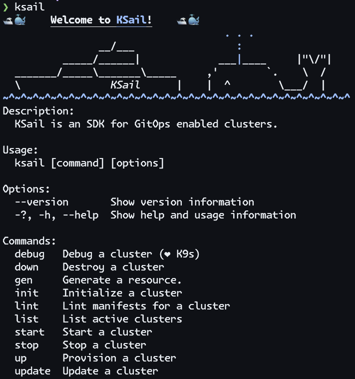

<div align="center">
  
</div>

# KSail

[](https://opensource.org/licenses/Apache-2.0)
[](https://github.com/devantler-tech/ksail/actions/workflows/test.yaml)
[](https://codecov.io/gh/devantler-tech/ksail)



## Getting Started

### Prerequisites

> [!NOTE]
> On MacOS, you need to "Allow the default Docker socket to be used (requires password)" in Docker Desktop settings.
>
> <details><summary>Show me how</summary>
>
> 
>
> </details>

KSail supports the following operating systems:

- MacOS (x64 and arm64)
- Linux (x64 and arm64)

### Installation

With Homebrew:

```sh
brew tap devantler-tech/formulas
brew install ksail
```

Manually:

1. Download the latest release for your OS from the [releases page](https://github.com/devantler-tech/ksail/releases).
2. Make the binary executable: `chmod +x ksail`.
3. Move the binary to a directory in your `$PATH`: `mv ksail /usr/local/bin/ksail`.

### Usage

Getting started with KSail is easy. First, you need a Kubernetes Cluster configuration for your project.

`> ksail init` - To initialize a new cluster configuration with default configurations.

From there, you probably want to ensure that your distribution and ksail is configured to your liking.

- `ksail-config.yaml` - The configuration file for KSail.
- `kind-config.yaml` - The configuration file for Kind.

When you are ready to provision your cluster, you can run:

`> ksail up` - To provision your new cluster.

From there, you can make some changes to your manifest files,, and when you are ready to apply them, you can run:

`> ksail update` - To update your cluster.

And for more advanced debugging, you can run:

`> ksail debug` - To debug your cluster with the K9s tool.

Finally, when you are done working with your cluster, you can run:

`> ksail stop` - To stop your cluster, so you can continue working on it later.

Or if you really want to get rid of it for now, you can run:

`> ksail down` - To dismantle your cluster and remove its resources.

## Documentation

- [Overview](./docs/0-overview.md)
- [Configuration](./docs/1-configuration.md)
- [Structure](./docs/2-structure.md)
- [CI](./docs/3-ci.md)
- [KSail CLI](./docs/4-ksail-cli.md)
- [Supported Tooling](./docs/5-supported-tooling.md)
- [FAQ](./docs/6-faq.md)
- [Roadmap](./docs/7-roadmap.md)

## Sub-projects

KSail is part of a larger ecosystem of projects that I maintain. These projects are designed to provide important functionality to KSail with high confidence, and without bloating the main repository. Most the projects provide extensible frameworks, so you can build your own tools on top of them, or make contributions to make KSail even more powerful.

- **[devantler-tech/dotnet-cli-runner](https://github.com/devantler-tech/dotnet-cli-runner)** - An implementation atop CLI Wrap to support running different binaries from C# code.
- **[devantler-tech/dotnet-container-engine-provisioner](https://github.com/devantler-tech/dotnet-container-engine-provisioner)** - Provisioners to provision resources in container engines like Docker or Podman.
- **[devantler-tech/dotnet-secret-manager](https://github.com/devantler-tech/dotnet-secret-manager)** - A secret manager to manage secrets in Git in a secure way.
- **[devantler-tech/dotnet-keys](https://github.com/devantler-tech/dotnet-keys)** - A library with key models, like the Age key model.
- **[devantler-tech/dotnet-kubernetes-generator](https://github.com/devantler-tech/dotnet-kubernetes-generator)** - Generators to create Kubernetes resources with `ksail init` and `ksail gen`.
- **[devantler-tech/dotnet-kubernetes-provisioner](https://github.com/devantler-tech/dotnet-kubernetes-provisioner)** - Provisioners to provision Kubernetes clusters and resources.
- **[devantler-tech/dotnet-kubernetes-validator](https://github.com/devantler-tech/dotnet-kubernetes-validator)** - A library that validates Kubernetes resources client-side or at runtime.
- **[devantler-tech/dotnet-template-engine](https://github.com/devantler-tech/dotnet-template-engine)** - A template engine to support code generation of non-serializable content.

### CLI Wrappers

These projects are CLI wrappers that provide a C# API for the respective CLI tools. They are used in KSail to embed and interact with CLI tools in a type-safe manner.

- **[devantler-tech/dotnet-age-cli](https://github.com/devantler-tech/dotnet-age-cli)** - A library that embeds and provides an API for the Age CLI.
- **[devantler-tech/dotnet-flux-cli](https://github.com/devantler-tech/dotnet-flux-cli)** - A library that embeds and provides an API for the Flux CLI.
- **[devantler-tech/dotnet-helm-cli](https://github.com/devantler-tech/dotnet-helm-cli)** - A library that embeds and provides an API for the Helm CLI.
- **[devantler-tech/dotnet-k3d-cli](https://github.com/devantler-tech/dotnet-k3d-cli)** - A library that embeds and provides an API for the K3d CLI.
- **[devantler-tech/dotnet-k9s-cli](https://github.com/devantler-tech/dotnet-k9s-cli)** - A library that embeds and provides an API for the K9s CLI.
- **[devantler-tech/dotnet-kind-cli](https://github.com/devantler-tech/dotnet-kind-cli)** - A library that embeds and provides an API for the Kind CLI.
- **[devantler-tech/dotnet-kubeconform-cli](https://github.com/devantler-tech/dotnet-kubeconform-cli)** - A library that embeds and provides an API for the Kubeconform CLI.
- **[devantler-tech/dotnet-kubectl-cli](https://github.com/devantler-tech/dotnet-kubectl-cli)** - A library that embeds and provides an API for the Kubectl CLI.
- **[devantler-tech/dotnet-kustomize-cli](https://github.com/devantler-tech/dotnet-kustomize-cli)** - A library that embeds and provides an API for the Kustomize CLI.
- **[devantler-tech/dotnet-sops-cli](https://github.com/devantler-tech/dotnet-sops-cli)** - A library that embeds and provides an API for the SOPS CLI.

## Related Projects

> [!NOTE]
> If you use KSail in your project, feel free to open a PR to add it to the list, so others can see how you use KSail.

KSail is a powerful tool that can be used in many different ways. Here are some projects that use KSail in their setup:

- **[devantler/homelab](https://github.com/devantler/homelab)** - My personal homelab setup.

## Presentations

- **[KSail - a Kubernetes SDK for local GitOps development and CI](https://youtu.be/Q-Hfn_-B7p8?si=2Uec_kld--fNw3gm)** - A presentation on KSail at KCD2024.

## Star History

<!-- readme-tree start -->
```
.
├── .github
│   └── workflows
├── .vscode
├── docs
│   └── images
├── schemas
├── src
│   ├── KSail
│   │   ├── Commands
│   │   │   ├── Debug
│   │   │   │   ├── Handlers
│   │   │   │   └── Options
│   │   │   ├── Down
│   │   │   │   └── Handlers
│   │   │   ├── Gen
│   │   │   │   ├── Commands
│   │   │   │   │   ├── CertManager
│   │   │   │   │   ├── Config
│   │   │   │   │   ├── Flux
│   │   │   │   │   ├── Kustomize
│   │   │   │   │   └── Native
│   │   │   │   ├── Handlers
│   │   │   │   │   ├── CertManager
│   │   │   │   │   ├── Config
│   │   │   │   │   ├── Flux
│   │   │   │   │   ├── Kustomize
│   │   │   │   │   └── Native
│   │   │   │   └── Options
│   │   │   ├── Init
│   │   │   │   ├── Generators
│   │   │   │   │   └── SubGenerators
│   │   │   │   ├── Handlers
│   │   │   │   └── Options
│   │   │   ├── Lint
│   │   │   │   └── Handlers
│   │   │   ├── List
│   │   │   │   ├── Handlers
│   │   │   │   └── Options
│   │   │   ├── Root
│   │   │   │   └── Handlers
│   │   │   ├── Secrets
│   │   │   │   ├── Arguments
│   │   │   │   ├── Commands
│   │   │   │   ├── Handlers
│   │   │   │   └── Options
│   │   │   ├── Start
│   │   │   │   └── Handlers
│   │   │   ├── Stop
│   │   │   │   └── Handlers
│   │   │   ├── Up
│   │   │   │   ├── Handlers
│   │   │   │   └── Options
│   │   │   └── Update
│   │   │       └── Handlers
│   │   ├── Options
│   │   └── Utils
│   ├── KSail.Generator
│   └── KSail.Models
│       ├── CLI
│       │   └── Commands
│       │       └── Secrets
│       ├── CNI
│       ├── Connection
│       ├── DeploymentTool
│       ├── MirrorRegistry
│       ├── Project
│       ├── Registry
│       ├── SecretManager
│       └── Template
└── tests
    ├── KSail.Generator.Tests
    │   └── KSailClusterGeneratorTests
    ├── KSail.Models.Tests
    └── KSail.Tests
        ├── Commands
        │   ├── Debug
        │   ├── Down
        │   ├── Gen
        │   ├── Init
        │   │   ├── mixed-advanced-multi
        │   │   │   └── k8s
        │   │   │       ├── clusters
        │   │   │       │   ├── cluster1
        │   │   │       │   │   ├── apps
        │   │   │       │   │   ├── flux-system
        │   │   │       │   │   ├── infrastructure
        │   │   │       │   │   │   ├── configs
        │   │   │       │   │   │   └── controllers
        │   │   │       │   │   └── variables
        │   │   │       │   └── cluster2
        │   │   │       │       ├── apps
        │   │   │       │       ├── flux-system
        │   │   │       │       ├── infrastructure
        │   │   │       │       │   ├── configs
        │   │   │       │       │   └── controllers
        │   │   │       │       └── variables
        │   │   │       ├── components
        │   │   │       │   ├── flux-kustomization-post-build-variables-label
        │   │   │       │   ├── flux-kustomization-sops-label
        │   │   │       │   ├── helm-release-crds-label
        │   │   │       │   └── helm-release-remediation-label
        │   │   │       ├── distributions
        │   │   │       │   ├── k3s
        │   │   │       │   │   ├── apps
        │   │   │       │   │   ├── infrastructure
        │   │   │       │   │   │   ├── configs
        │   │   │       │   │   │   └── controllers
        │   │   │       │   │   └── variables
        │   │   │       │   └── native
        │   │   │       │       ├── apps
        │   │   │       │       ├── infrastructure
        │   │   │       │       │   ├── configs
        │   │   │       │       │   └── controllers
        │   │   │       │       └── variables
        │   │   │       └── shared
        │   │   │           ├── apps
        │   │   │           ├── infrastructure
        │   │   │           │   ├── configs
        │   │   │           │   └── controllers
        │   │   │           └── variables
        │   │   ├── mixed-simple-multi
        │   │   │   └── k8s
        │   │   │       ├── apps
        │   │   │       ├── clusters
        │   │   │       │   ├── cluster1
        │   │   │       │   │   └── flux-system
        │   │   │       │   └── cluster2
        │   │   │       │       └── flux-system
        │   │   │       └── infrastructure
        │   │   │           ├── configs
        │   │   │           └── controllers
        │   │   ├── native-advanced
        │   │   │   └── k8s
        │   │   │       ├── clusters
        │   │   │       │   └── ksail-advanced-native
        │   │   │       │       ├── apps
        │   │   │       │       ├── flux-system
        │   │   │       │       ├── infrastructure
        │   │   │       │       │   ├── configs
        │   │   │       │       │   └── controllers
        │   │   │       │       └── variables
        │   │   │       ├── components
        │   │   │       │   ├── flux-kustomization-post-build-variables-label
        │   │   │       │   ├── flux-kustomization-sops-label
        │   │   │       │   ├── helm-release-crds-label
        │   │   │       │   └── helm-release-remediation-label
        │   │   │       ├── distributions
        │   │   │       │   └── native
        │   │   │       │       ├── apps
        │   │   │       │       ├── infrastructure
        │   │   │       │       │   ├── configs
        │   │   │       │       │   └── controllers
        │   │   │       │       └── variables
        │   │   │       └── shared
        │   │   │           ├── apps
        │   │   │           ├── infrastructure
        │   │   │           │   ├── configs
        │   │   │           │   └── controllers
        │   │   │           └── variables
        │   │   ├── native-advanced-existing
        │   │   │   └── k8s
        │   │   │       ├── clusters
        │   │   │       │   └── ksail-advanced-native
        │   │   │       │       ├── apps
        │   │   │       │       ├── flux-system
        │   │   │       │       ├── infrastructure
        │   │   │       │       │   ├── configs
        │   │   │       │       │   └── controllers
        │   │   │       │       └── variables
        │   │   │       ├── components
        │   │   │       │   ├── flux-kustomization-post-build-variables-label
        │   │   │       │   ├── flux-kustomization-sops-label
        │   │   │       │   ├── helm-release-crds-label
        │   │   │       │   └── helm-release-remediation-label
        │   │   │       ├── distributions
        │   │   │       │   └── native
        │   │   │       │       ├── apps
        │   │   │       │       ├── infrastructure
        │   │   │       │       │   ├── configs
        │   │   │       │       │   └── controllers
        │   │   │       │       └── variables
        │   │   │       └── shared
        │   │   │           ├── apps
        │   │   │           ├── infrastructure
        │   │   │           │   ├── configs
        │   │   │           │   └── controllers
        │   │   │           └── variables
        │   │   ├── native-simple
        │   │   │   └── k8s
        │   │   │       ├── apps
        │   │   │       ├── clusters
        │   │   │       │   └── ksail-default
        │   │   │       │       └── flux-system
        │   │   │       └── infrastructure
        │   │   │           ├── configs
        │   │   │           └── controllers
        │   │   └── native-simple-existing
        │   │       └── k8s
        │   │           ├── apps
        │   │           ├── clusters
        │   │           │   ├── cluster1
        │   │           │   │   └── flux-system
        │   │           │   ├── cluster2
        │   │           │   │   └── flux-system
        │   │           │   └── ksail-default
        │   │           │       └── flux-system
        │   │           └── infrastructure
        │   │               ├── configs
        │   │               └── controllers
        │   ├── Lint
        │   ├── List
        │   ├── Root
        │   ├── Secrets
        │   ├── Start
        │   ├── Stop
        │   ├── Up
        │   └── Update
        ├── E2E
        └── Utils

220 directories
```
<!-- readme-tree end -->
