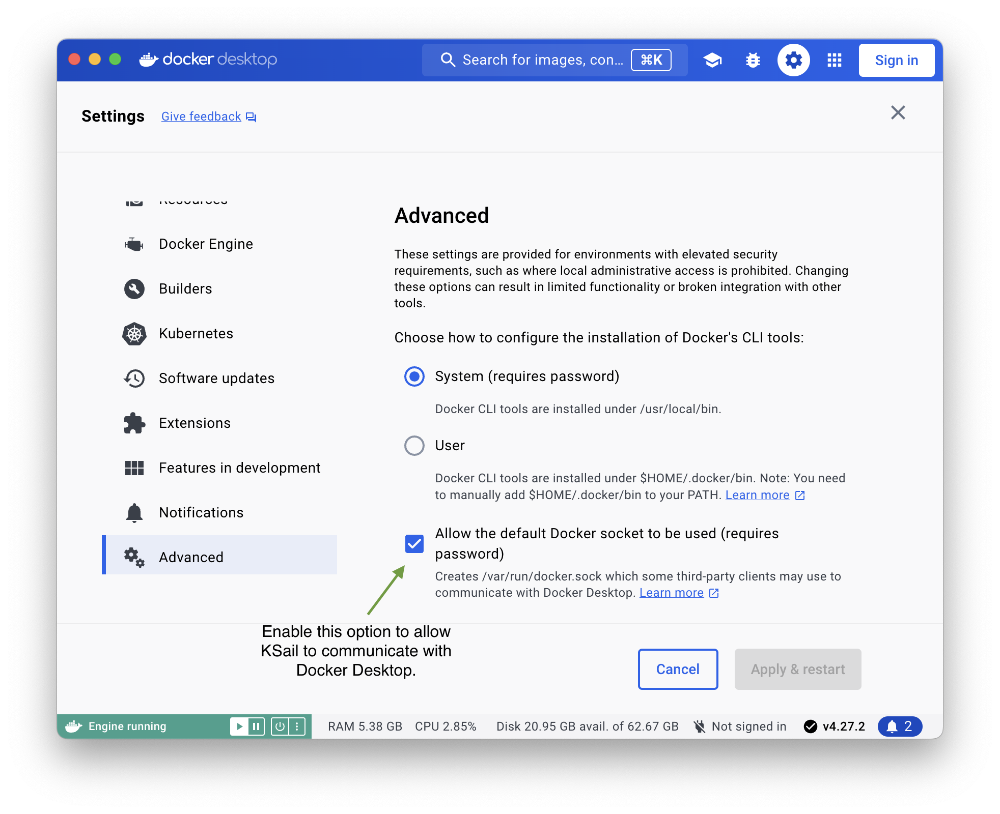

> [!NOTE]
> A larger restructuring is on the way, where all embedded binaries are extracted into their own .NET project. This makes it much easier for me to maintain. However this also means that KSail will not see bug fixes and feature releases before late this year, as the changes are expected to take a few months to get right.
> Follow the progress on:
>
> - [ ] [devantler/dotnet-age-cli](https://github.com/devantler/dotnet-age-cli)
> - [ ] [devantler/dotnet-flux-cli](https://github.com/devantler/dotnet-flux-cli)
> - [ ] [devantler/dotnet-k3d-cli](https://github.com/devantler/dotnet-k3d-cli)
> - [ ] [devantler/dotnet-k9s-cli](https://github.com/devantler/dotnet-k9s-cli)
> - [ ] [devantler/dotnet-kind-cli](https://github.com/devantler/dotnet-kind-cli)
> - [ ] [devantler/dotnet-kubeconform-cli](https://github.com/devantler/dotnet-kubeconform-cli)
> - [ ] [devantler/dotnet-kustomize-cli](https://github.com/devantler/dotnet-kustomize-cli)
> - [ ] [devantler/dotnet-sops-cli](https://github.com/devantler/dotnet-sops-cli)
> - [ ] [devantler/dotnet-sops-manager](https://github.com/devantler/dotnet-sops-manager)
> - [x] [devantler/dotnet-cli-runner](https://github.com/devantler/dotnet-cli-runner)
> - [x] [devantler/dotnet-template-engine](https://github.com/devantler/dotnet-template-engine)
> - [x] [devantler/dotnet-keys](https://github.com/devantler/dotnet-keys)

<div align="center">
  
</div>

# 🛥️🐳 KSail

[](https://opensource.org/licenses/Apache-2.0)
[](https://github.com/devantler/ksail/actions/workflows/test.yaml)
[](https://codecov.io/gh/devantler/ksail)


<details>
  <summary>Show/hide folder structure</summary>

<!-- readme-tree start -->
```
.
├── .github
│   └── workflows
├── .vscode
├── docs
│   └── images
├── scripts
├── src
│   └── KSail
│       ├── Arguments
│       ├── CLIWrappers
│       ├── Commands
│       │   ├── Check
│       │   │   └── Handlers
│       │   ├── Debug
│       │   │   └── Handlers
│       │   ├── Down
│       │   │   ├── Handlers
│       │   │   └── Options
│       │   ├── Init
│       │   │   ├── Generators
│       │   │   └── Handlers
│       │   ├── Lint
│       │   │   └── Handlers
│       │   ├── List
│       │   │   └── Handlers
│       │   ├── Root
│       │   │   └── Handlers
│       │   ├── SOPS
│       │   │   ├── Handlers
│       │   │   └── Options
│       │   ├── Start
│       │   │   └── Handlers
│       │   ├── Stop
│       │   │   └── Handlers
│       │   ├── Up
│       │   │   ├── Handlers
│       │   │   └── Options
│       │   └── Update
│       │       ├── Handlers
│       │       └── Options
│       ├── Enums
│       ├── Extensions
│       ├── Models
│       │   ├── K3d
│       │   ├── KSail
│       │   ├── Kubernetes
│       │   │   └── FluxKustomization
│       │   └── SOPS
│       ├── Options
│       ├── Provisioners
│       │   ├── ContainerEngine
│       │   ├── ContainerOrchestrator
│       │   ├── GitOps
│       │   ├── KubernetesDistribution
│       │   └── SecretManager
│       └── assets
│           ├── binaries
│           └── templates
│               ├── k3d
│               ├── kubernetes
│               └── sops
└── tests
    └── KSail.Tests
        ├── Commands
        │   ├── Check
        │   ├── Debug
        │   ├── Down
        │   ├── Lint
        │   ├── List
        │   ├── Root
        │   ├── SOPS
        │   ├── Up
        │   └── Update
        └── TestUtils

74 directories
```
<!-- readme-tree end -->

</details>

## Getting Started

### Prerequisites

> [!NOTE]
> On MacOS (darwin) you need to "Allow the default Docker socket to be used (requires password)" in Docker Desktop settings.
>
> <details><summary>Show me how!</summary>
>
> 
>
> </details>

KSail supports MacOS and Linux on the following platforms:

- darwin-amd64 
- darwin-arm64 
- linux-amd64 🐧
- linux-arm64 🐧

If you are using Windows, you can use WSL2 to run KSail.

### Installation

With Homebrew:

```sh
brew tap devantler/formulas
brew install ksail
```

Manually:

1. Download the latest release from the [releases page](https://github.com/devantler/ksail/releases).
2. Make the binary executable: `chmod +x ksail`.
3. Move the binary to a directory in your `$PATH`: `mv ksail /usr/local/bin/ksail`.

### Usage

Getting started with KSail is easy. Here are a few commands to get you started:

> `ksail init <name-of-cluster>` - To initialize your cluster.
> 
> `ksail up <name-of-cluster>` - To provision your cluster.

From there, you can make some changes to your manifest files, and when you are ready to apply them, you can run:

>`ksail update <name-of-cluster>` - To update your cluster.

At some point, you might encounter an issue, and wonder what is going on. In that case, you can run:

> `ksail check` - To check the status of your cluster reconciliations.

And for more advanced debugging, you can run:

> `ksail debug` - To debug your cluster with the K9s tool.

Finally, when you are done working with your cluster, you can run:

> `ksail stop <name-of-cluster>` - To stop your cluster, so you can continue working on it later.

Or if you really want to get rid of it for now, you can run:

> `ksail down <name-of-cluster>` - To dismantle your cluster and remove its resources.

## Documentation

> [!NOTE]
> The documentation is a work in progress. When it is more mature, it will be made available on <ksail.devantler.com>.
> For now it includes the information that was originally available in this README with a few additions.

- [Overview](./docs/0-overview.md)
- [Getting Started](./docs/1-getting-started.md)
- [Configuration](./docs/2-configuration.md)
- [Structure](./docs/3-structure.md)
- [CI](./docs/4-ci.md)
- [KSail CLI](./docs/5-ksail-cli.md)
- [Supported Tooling](./docs/6-supported-tooling.md)
- [FAQ](./docs/7-faq.md)
- [Roadmap](./docs/8-roadmap.md)

## Related Projects

- [OCI Artifacts](https://github.com/devantler/oci-artifacts) - Ready-to-deploy OCI artifacts for Flux GitOps-enabled clusters.
- [Homelab](https://github.com/devantler/homelab) - My personal homelab setup, including an example of how I use KSail to manage my Homelab cluster.

## Contributions

Contributions to KSail are welcome! You can contribute by reporting bugs, requesting features, or submitting pull requests. When creating an issue or pull request, please provide as much detail as possible to help understand the problem or feature. Check out the [Contribution Guidelines](https://github.com/devantler/ksail/blob/main/CONTRIBUTING.md) for more info.

## Star History

[](https://star-history.com/#devantler/ksail&Date)
