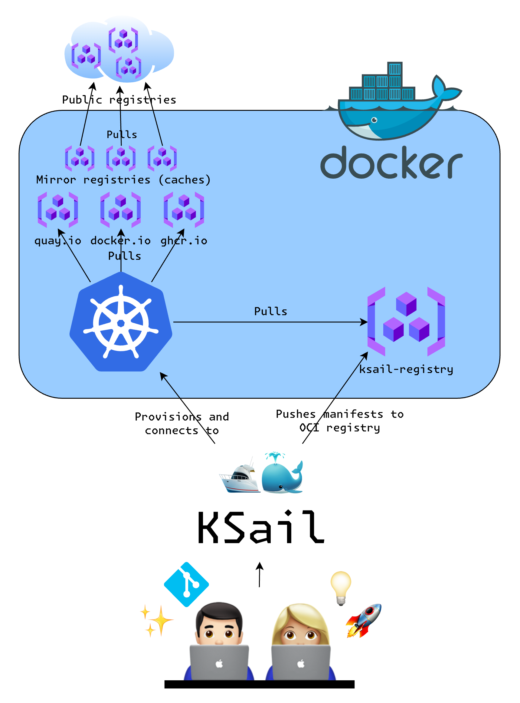

# Overview

KSail is a CLI tool designed to simplify the management of GitOps-enabled Kubernetes clusters locally and in CI pipelines. It enables you to easily create, manage, and dismantle GitOps-enabled clusters in Container Engines, such that you can develop and test your applications in a fully local Kubernetes environment, or in CI/CD pipelines, before deploying changes to remote environments.

  

## Key Features

- **Initialize GitOps projects:** KSail can be used to generate cluster configurations, with templates to get you started.
- **Initialize declarative configurations:** KSail can be used to generate declarative configurations for anything from configuring KSail itself, to configuring the Kubernetes distribution you are using.
- **Managing secrets in Git:** KSail can be used to manage secrets in Git repositories with SOPS and Age.
- **Generate Kubernetes resources:** KSail can be used to generate Kubernetes resources, so you do not have to write a lot of boilerplate code.
- **Create clusters:** KSail can be used to create GitOps-enabled Kubernetes clusters in Container Engines with various Kubernetes distributions.
- **Update clusters:** KSail can be used to update running Kubernetes clusters with changes you make to your manifest files.
- **Client-side validation / Linting:** KSail can be used to validate and lint your manifest files before deploying your clusters.
- **Server-side validation:** KSail can be used to validate your running clusters, by querying its APIs with popular tools like Polaris.
- **Debug clusters:** KSail can be used to debug your clusters with the K9s tool.
- **Check cluster reconciliations:** KSail can be used to verify that your clusters reconcile successfully.

## Why was it made?

KSail was created to fill a gap in the tooling landscape for managing GitOps-enabled Kubernetes clusters in Docker. There are currently two intended use cases for KSail:

- **Local Development:** KSail can be used to create and manage GitOps-enabled Kubernetes clusters in Docker for local development. This allows you to easily build and test your applications in a K8s environment.
- **CI/CD:** KSail can be used to spin up GitOps-enabled Kubernetes clusters in CI/CD, to easily verify that your changes are working as expected before deploying them to your other environments.

However the project also strives to provide a better Developer Experience (DX) for working with Kubernetes in general, by simplifying the management of highly complex Kubernetes clusters to a few simple commands.

## How does it work?

KSail leverages several key technologies to provide its functionality:

- **Embedded Binaries:** KSail embeds binaries, and provides APIs for awesome Kubernetes CLI tools. This enables KSail to work out of the box without requiring you to install any additional dependencies.
- **Container Engine Backends:** KSail uses various Container Engine backends, allowing you to run encapsulated Kubernetes clusters inside containers with a small footprint.
- **OCI registries:** KSail uses OCI registries to pull and push images to and from your clusters. This is what enables you to build and test your applications locally without needing to push them to a remote registry.
- **Flux GitOps:** KSail sets up Flux GitOps to manage the deployment of your clusters, with your manifest source serving as the single source of truth.
- **K9s Integration:** KSail integrates with K9s to provide a powerful CLI tool for debugging your clusters.
- **SOPS and Age Integration:** KSail integrates with SOPS and Age for managing secrets in Git repositories.
- **Kustomize and Kubeconform Integration:** KSail integrates with Kustomize and Kubeconform for linting your manifest files before deploying your clusters.
- **Kubernetes API:** KSail uses the Kubernetes API to verify that your clusters reconcile successfully after deployment.

### The initialization process

> [!NOTE]
> Will be updated soon.

Generates a small cluster configuration with my recommended structure and a few services to get started. The generated files are as follows:

- `k8s/clusters/*` - This folder contains cluster configurations. This is the entrypoint for flux. I recommend having one cluster configuration per env (local, dev, test, prod).
- `k8s/manifests/*` - This folder contains all the manifests to deploy. It is organized according to its kustomization, and it is assumed that all clusters can deploy these files (use flux-post-build variables for variables).
- `*.k3d-config.yaml` file to configure your K3d cluster. You can check out [the official k3d docs](https://k3d.io/v5.1.0/usage/configfile/) on how to use this configuration file.
- `.sops.yaml` file to configure SOPS. You can check out [the official SOPS docs](https://getsops.io/docs/#using-sopsyaml-conf-to-select-kms-pgp-and-age-for-new-files) on how to use this configuration file to configure which files should be encrypted/decrypted by which keys.

> [!NOTE]
> KSail will target the `k8s/clusters/<cluster-name>/flux-system` flux kustomizations. So you can follow their paths to get an idea on how the files are related.

> [!NOTE]
> Flux kustomizations target files and folders within the flux-system OCI container that KSail creates. This container contains all files within `k8s/**`, so be aware that the paths are not from your projects root directory.

### The provisioning process

> [!NOTE]
> Will be updated soon.
